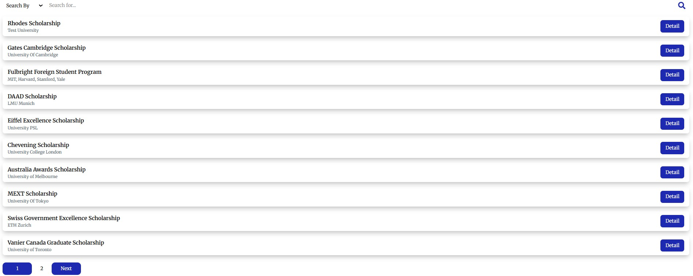
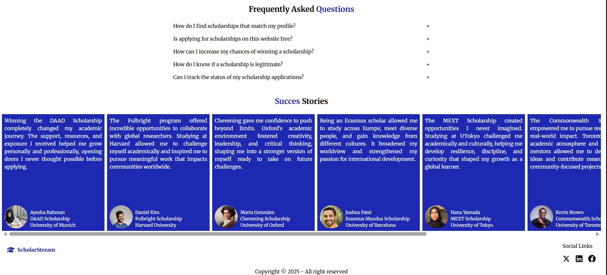

<p align="center">
  
  
  
</p>


---

# 🚀 ScholarStream

A full-stack  web app for hunting scholarships around the world.

👉 **[Live Demo](https://scholarstream-shoaib221.netlify.app/)**

---

## ✨ Features
- ⚡ Admins can create and update scholarship announcements
- ⚡ Applicants can search for scholarships according to location, time, subject preference, and scholarship amount
- ⚡ Applicants can pay fees through stripe payment gateway
- ⚡ Moderators are responsible for assessing applications and giving feedback

---

## 🧰 Tech Stack

**Frontend:**
- React.js  
- Tailwind CSS  & Daisy UI

**Backend:**
- Node.js  
- Express.js  
- MongoDB & Mongoose  

**Authentication:**
- Firebase Auth  

**Deployment:**
- Frontend: Netlify  
- Backend: Vercel  

---

## 📦 Packages Used
- swiper
- react-toastify
- framer motion


## 🧑‍💻 Setup Instructions

```bash

git clone https://github.com/shoaib221/ScholarStream.git
cd backend
cd frontend
npm install
npm run dev


